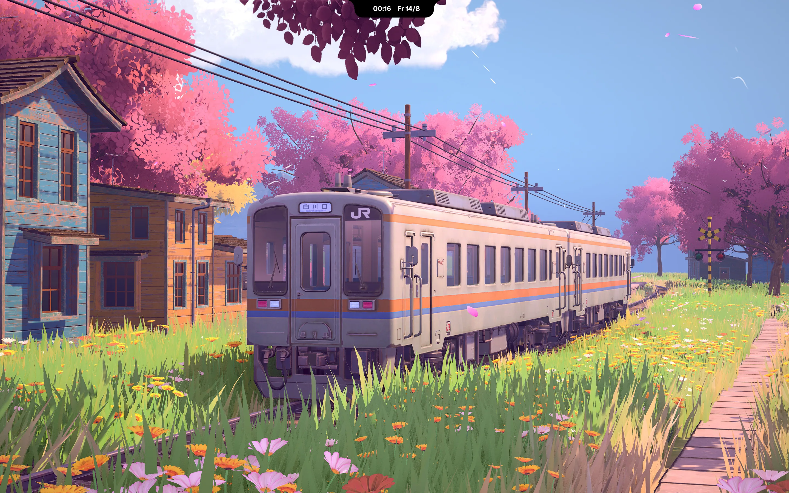
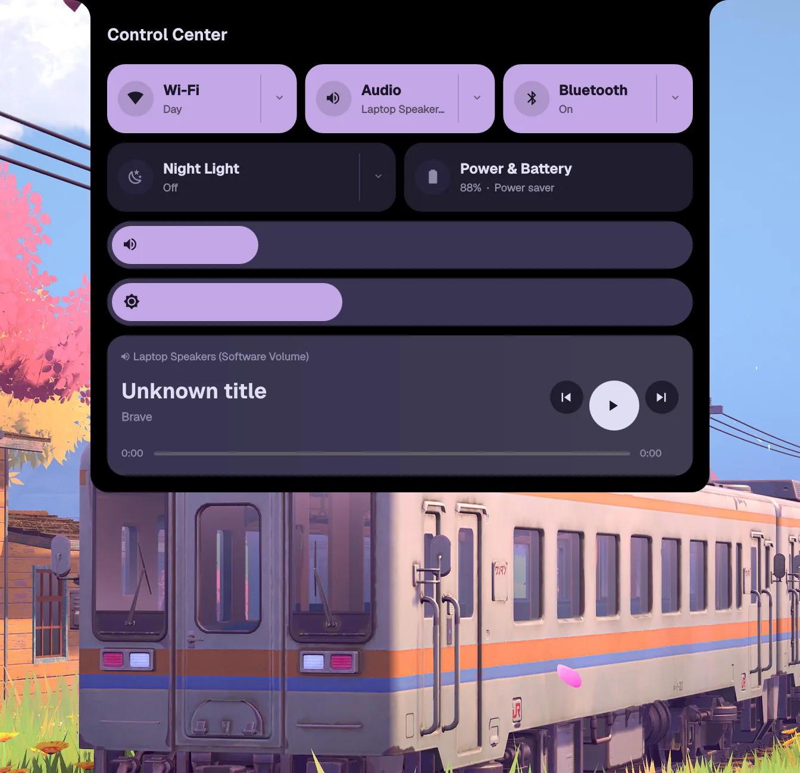
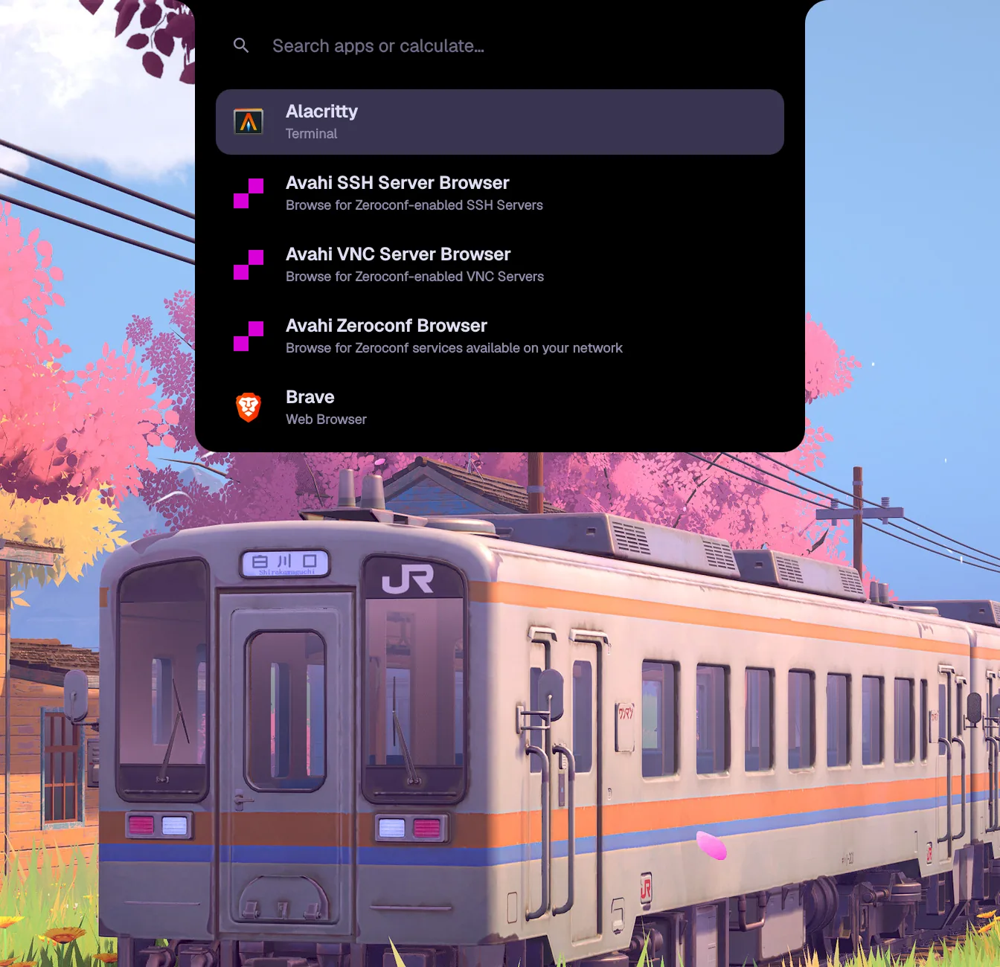
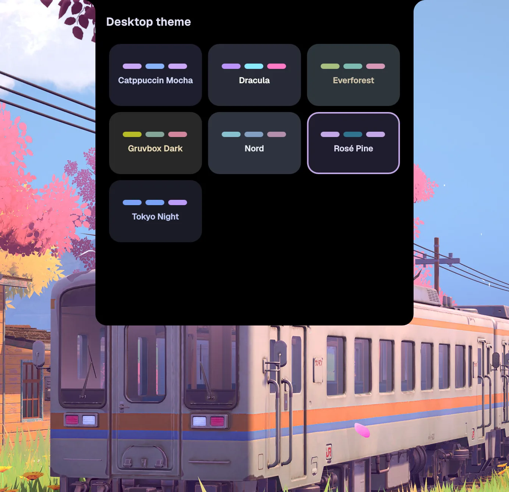
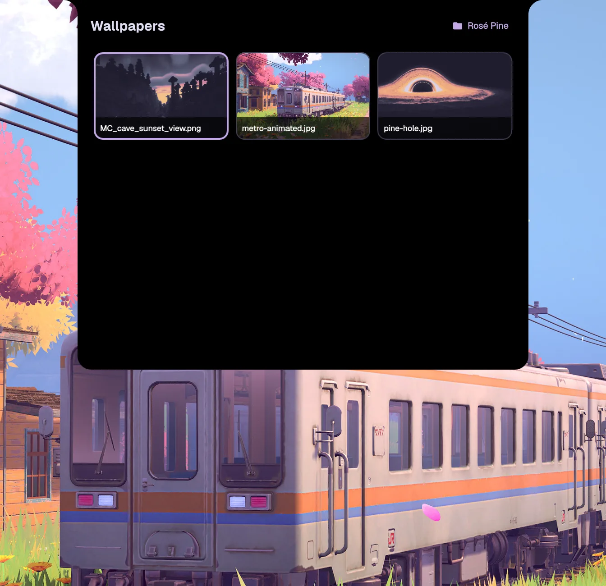
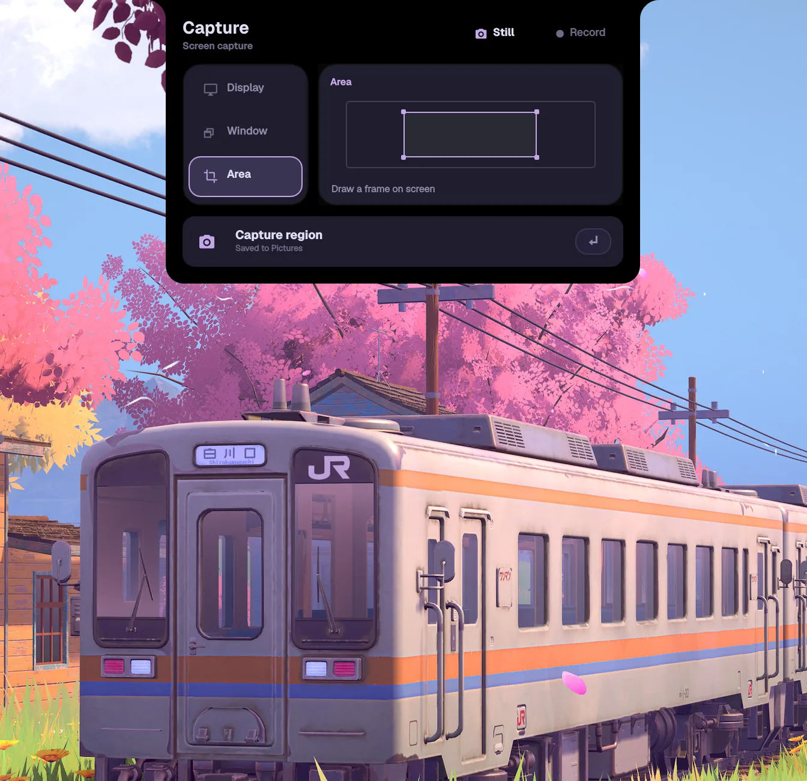
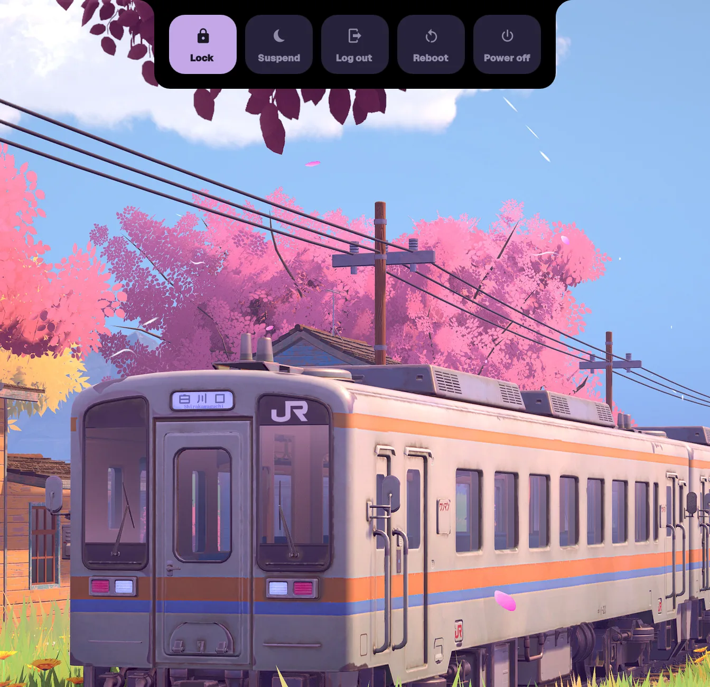

# vyeos/dotfiles

An opinionated Arch Linux rice built around Hyprland and a custom Quickshell
notch. It keeps the desktop quiet when idle, then expands into a keyboard-first
launcher, control center, clipboard, task manager, notes editor, appearance
picker, capture tool, and power menu.



## The rice

### One notch, the whole shell

The centered notch shows the time and date in its collapsed state. Click it or
use a shortcut and it grows into the requested panel, with animated size and
content transitions, full keyboard navigation, focus handling, and Escape to
close. Quickshell also owns the themed notification popups, including urgency
colors, images, actions, and automatic dismissal.

### Control center



The control center brings the everyday hardware controls into one surface:

- Wi-Fi scanning, secured-network connection, and signal information
- audio output selection, mute, and volume
- Bluetooth discovery, pairing, connection, and device battery information
- adjustable night light and cycling power profiles
- display brightness, laptop battery state, and system tray items
- MPRIS media metadata, timeline, and previous/play/next controls

### Launcher and clipboard



The launcher filters installed desktop applications as you type and doubles as
an inline calculator. The matching clipboard panel searches the latest 50
`cliphist` entries, handles text and image history, previews full content, and
pastes the selected entry back into the previously focused window.

### Todos and quick notes

The shell includes two small productivity tools without pulling in a separate
desktop app:

- **Todos** support all/active/done views, priorities, categories, due dates,
  notes, editing, reordering, and clearing completed items. The add field also
  understands compact input such as `!high`, `#college`, and `today`.
- **Quick Notes** stores Markdown notes, offers recent-note search, pinning,
  deletion, task-list blocks, undo/redo, autosave, and Markdown copy. Notes are
  saved below `~/Notes/Quick` (or `$NOTES_DIR`).

Both panels are designed to be completely usable from the keyboard. Their
contents are deliberately omitted from the screenshots because they are local
user data.

### Themes and wallpapers



Seven bundled palettes—Catppuccin Mocha, Dracula, Everforest, Gruvbox Dark,
Nord, Rosé Pine, and Tokyo Night—are generated from one JSON source of truth.
A switch updates Quickshell, Hyprland, Hyprlock, SDDM, Alacritty, GTK,
Fish/eza, Papirus folder colors, and Neovim; Hyprland, Alacritty, and
Quickshell reload immediately. SDDM uses the same palette and a blurred static
frame of the theme's selected wallpaper on the next login.



Wallpapers live in `~/Pictures/Wallpapers/<theme>` and the picker only shows the
active theme's collection. Selection is persisted and restored by `awww` on the
next login. Animated wallpapers supported by `awww` work here too.

From a terminal, the same system is available as:

```sh
theme-switch everforest
wallpaper-set ~/Pictures/Wallpapers/everforest/example.jpg
```

### Screenshots and recording



The capture panel takes full-display, window, or freely drawn area screenshots.
Its native Quickshell selector supports rounded window targeting, live region
dimensions, multiple monitors, and cancellation; every image is saved below
`~/Pictures/Screenshots` and copied to the clipboard. The same panel records the
full display to `~/Videos/Recordings` and lets you toggle microphone capture.

### Session and lock screen



The compact power menu provides lock, suspend, log out, reboot, and power off,
with confirmation for destructive actions. Hyprlock uses a blurred snapshot of
the current desktop, a large clock and date, themed password feedback, and
matching entrance/exit animations. Hypridle turns off the keyboard backlight
after inactivity and restores it on input.

### Window manager and terminal workflow

Hyprland uses a rounded, blurred `dwindle` layout with subtle transparency,
theme-colored borders, spring window animations, ten workspaces, and a special
scratchpad. Caps Lock is remapped to **Hyper** (`Mod3`) so application shortcuts
stay separate from window-management shortcuts.

The rest of the environment follows the same palette: Alacritty with
JetBrainsMono Nerd Font, Fish with a Git-aware prompt and themed `eza` colors,
and a LazyVim-based Neovim setup.

## Keyboard shortcuts

`Super` is the Windows key. `Hyper` is Caps Lock, remapped through
`caps:hyper`—it no longer toggles caps lock.

### Shell panels

| Shortcut | Action |
| --- | --- |
| `Hyper+C` | Toggle control center |
| `Super+Space` | Toggle app launcher / calculator |
| `Super+V` | Toggle clipboard history |
| `Hyper+/` | Toggle todo manager |
| `Hyper+N` | Toggle quick notes |
| `Super+Shift+T` | Toggle desktop theme selector |
| `Super+Shift+W` | Toggle wallpaper selector |
| `Super+Shift+C` | Toggle capture and recording panel |
| `Super+Escape` | Toggle power menu |
| `Escape` | Close the open shell panel or capture selector |
| `Arrow keys` | Move focus or selection in the open panel |
| `Enter` / `Space` | Activate the focused control |

### Applications and windows

| Shortcut | Action |
| --- | --- |
| `Hyper+Enter` | Open Alacritty |
| `Hyper+B` | Open Brave |
| `Hyper+E` | Open Nautilus |
| `Hyper+T` | Open T3 Code (local path) |
| `Hyper+O` | Open OBS Studio |
| `Super+W` | Close the focused window |
| `Super+M` | Exit Hyprland (`hyprshutdown` when available) |
| `Super+T` | Toggle floating |
| `Super+F` | Toggle fullscreen |
| `Super+H/J/K/L` | Focus left/down/up/right |
| `Super+Shift+H/J/K/L` | Move the focused window left/down/up/right |
| `Super+-` / `Super+=` | Shrink / grow window width by 100 px |
| `Super+Shift+-` / `Super+Shift+=` | Shrink / grow window height by 100 px |
| `Super+left drag` | Move a window |
| `Super+right drag` | Resize a window |

### Workspaces

| Shortcut | Action |
| --- | --- |
| `Super+1` … `Super+0` | Switch to workspace 1 … 10 |
| `Super+Shift+1` … `Super+Shift+0` | Move the focused window to workspace 1 … 10 |
| `Super+mouse wheel` | Cycle through existing workspaces |
| `Super+S` | Toggle the `magic` scratchpad |
| `Super+Shift+S` | Move the focused window to the scratchpad |

### Capture and media keys

| Shortcut | Action |
| --- | --- |
| `Alt+Shift+1` | Screenshot the full display |
| `Alt+Shift+2` | Select and screenshot a window |
| `Alt+Shift+3` | Draw and screenshot a region |
| `Alt+Shift+4` | Start or stop screen recording |
| `Volume Up` / `Volume Down` | Change output volume by 5% |
| `Volume Mute` | Toggle output mute |
| `Mic Mute` | Toggle microphone mute |
| `Brightness Up` / `Brightness Down` | Change display brightness by 5% |
| `Media Play/Pause` | Toggle playback |
| `Media Previous` / `Media Next` | Change track |

The hardware shortcuts remain available while the session is locked.

### Panel-specific controls

| Context | Shortcut | Action |
| --- | --- | --- |
| Launcher | `Up` / `Down`, `Enter` | Select and launch an app or accept a calculation |
| Clipboard | `Up` / `Down`, `Enter`, `Space` | Select, paste, or preview an entry |
| Todos | `/` | Focus the add-task field |
| Todos | `J` / `K` or `Down` / `Up` | Select a task |
| Todos | `Left` / `Right` | Change all/active/done view |
| Todos | `Space` | Toggle the selected task |
| Todos | `E` / `D` | Edit the task title / open task details |
| Todos | `Ctrl+Up` / `Ctrl+Down` | Reorder the selected task |
| Quick Notes | `Alt+N` / `Alt+P` | Create a note / search recent notes |
| Quick Notes list | `J` / `K`, `Enter`, `Delete` | Select, open, or delete a note |
| Quick Notes editor | `Ctrl+S` | Save immediately |
| Quick Notes editor | `Ctrl+Z`, `Ctrl+Shift+Z` / `Ctrl+Y` | Undo and redo |
| Quick Notes editor | `Enter`, empty `Backspace` | Split or merge Markdown blocks |
| Quick Notes editor | `Up` / `Down`, `Escape` | Move between blocks / return to the note list |
| Theme/wallpaper | Arrow keys, `Enter` / `Space` | Navigate and apply a tile |
| Capture/power | Arrow keys, `Enter` / `Space` | Navigate and activate an action |

## Installation

> [!WARNING]
> This is a personal Arch setup, not a distro-agnostic installer. Read the
> scripts before running them. The Hyprland config also contains local launch
> paths for T3 Code and OBS that you may want to change.

1. Install `git` before cloning. Partition the disk, create the Btrfs
   subvolumes documented in `system/templates/fstab.template`, mount the target,
   and generate that machine's `/etc/fstab` with `genfstab -U`.
2. Clone this repository as the target user and run
   `scripts/install-packages.sh`. It installs the explicit pacman packages. To
   install the AUR list, bootstrap `yay` using the AUR instructions and rerun
   the script.
3. Run `scripts/install-system.sh`, then `sudo locale-gen` and
   `sudo mkinitcpio -P`. Link `/etc/resolv.conf` to
   `/run/systemd/resolve/stub-resolv.conf` before rebooting. The installer
   enables SDDM, NetworkManager, systemd-resolved, and Bluetooth.
4. Run `scripts/install-dotfiles.sh`. It symlinks the configuration, creates the
   wallpaper folders, downloads the upstream `alacritty-theme` collection, and
   moves replaced files to `~/.dotfiles-backups/<timestamp>/`.

On an existing installation, apply only the new SDDM integration with
`sudo scripts/install-sddm-theme.sh`; the full system installer also runs this
step automatically.

## Machine-specific notes

The PipeWire and WirePlumber overrides are tailored to this machine's ALC285
speaker arrangement. They create a persistent software-volume sink so the main
speakers and bass-speaker DAC attenuate together; the physical sink should stay
at 100%. A user service also restores the built-in microphone to its 0 dB
hardware baseline and unmutes it when the audio session starts.

Credentials, browser profiles, caches, histories, SSH/GPG keys, host-specific
filesystem UUIDs, and Fish universal-variable state are intentionally excluded
from the repository.
